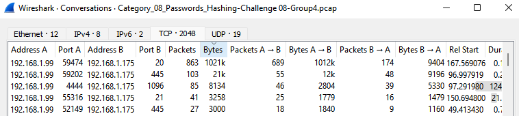
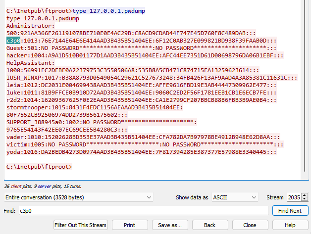

### Capture The Flag

#### `Harry Randazzo`

#### Team 4

-----

Navigate using your arrow keys. If you see a &#8681; in the bottom right nav there is content below. Try it now!

---

## Nice!

To view all slides press the `ESC` key, otherwise press right arrow (`>`) to move to the next slide.

> If the slide content is too cramped, try zooming out w/ `CTRL` + `-`

-----

## Introduction

- The CTF Problem - I chose to explain all of _Category 8: Password Hashing_
- Steps to Solve
- The Solution(s)
- Workplace Relevance

-----

## CTF Category Description

> Goal: Given the hash, find the password.

This category is all about cracking password hashes (cryptologically generated representations of data identity).  This site has a really great explanation on what hashing is - [LINK](https://www.thesslstore.com/blog/difference-encryption-hashing-salting/).

-----

## Initial Approach

1. Boot up a [Kali](https://www.kali.org/) Linux VM.
2. Identify commonalities between hashes; i.e. the same algorithm, salt, iterations, etc.
3. Break each group into its own text file.
4. Test each group for hash type w/ [hash-identifier](https://tools.kali.org/password-attacks/hash-identifier).
5. Perform necessary steps to crack each type.

-----

## Problems 1-4

Hashes:

```text
bart:"":"":A988BBFD3CFDE311AAD3B435B51404EE:9CE736F7B01B851A7BBB9DA1B67E6C98

snowball:"":"":D8C770C7E94592D9AAD3B435B51404EE:EEC1E8A883208C9A53FD91821F0EAB68

santaslittlehelper:"":"":C41A0804FF1D42C3AAD3B435B51404EE:5A32DC0BCECC74248C38C4B22A6EDE94

moe:"":"":6CD585939C65CA69AAD3B435B51404EE:AA833964D79A9FEEA8F95E55A9A67F84
```

---

## Approach

- Looking at these four hashes, I identified that the first hash given in for each user ended in `AAD3B435B51404EE`.
- Searching online about this led me to [this](https://yougottahackthat.com/blog/339/what-is-aad3b435b51404eeaad3b435b51404ee) site.
- This site explained that I was looking at a NT/LM hash.
  - _"Typically if you see lots of  “404ee” at the end of the LM part you are up against a Windows 2008 (or later) domain which never required backwards compatibility."_

---

## Command

```bash
john --format=lm lm.txt
```
- Throw these four hashes into a text file.
- Launch John the Ripper w/ hash format `lm`.

---

## Output

```bash
Using default input encoding: UTF-8
Using default target encoding: CP850
Loaded 4 password hashes with no different salts (LM [DES 512/512 AVX512F])
Warning: poor OpenMP scalability for this hash type, consider --fork=16
Will run 16 OpenMP threads
Proceeding with single, rules:Single
Press 'q' or Ctrl-C to abort, almost any other key for status
Almost done: Processing the remaining buffered candidate passwords, if any.
Proceeding with wordlist:/usr/share/john/password.lst, rules:Wordlist
BARTMAN          (?)
Proceeding with incremental:LM_ASCII
MYCAT            (?)
BARKEEP          (?)
GOODDOG          (?)
4g 0:00:00:05 DONE 3/3 (2021-07-17 18:23) 0.7889g/s 57484Kp/s 57484Kc/s 64118KC/s GODAR14..GOLYL24
Use the "--show --format=LM" options to display all of the cracked passwords reliably
Session completed

$ john --format=lm lm.txt --show

bart:BARTMAN
snowball:MYCAT
santaslittlehelper:GOODDOG
moe:BARKEEP

4 password hashes cracked, 0 left
```

> Answer: `[BARTMAN, MYCAT, GOODDOG, BARKEEP]`

-----

## Problems 5-8

Hashes:

```text
oscar:1135:NOPASSWORD*********************:488CDCDD2225312793ED6967B28C1025:::

cookiemonster:1136:NOPASSWORD*********************:7BA85FD1EDF397D8E180F6E16529EC38:::

raylewis:1137:NOPASSWORD*********************:067ABEC2947816E38AC345B1DD46E534:::

lamarjackson:1138:NOPASSWORD*********************:A675081AAF0B43D60A819653635AC405:::
```

---

## Approach

- As identified by [hash-identifier](https://tools.kali.org/password-attacks/hash-identifier), these are MD4 hashes.
- So all I had to do was throw these in a file - `md4_hashes.txt` and run John the Ripper on it.

---

## Command

```bash
$ john md4_hashes.txt
```
- Simple, no-frills launch of John the Ripper.
- This leaves all options as default.

---

## Output

```bash
Using default input encoding: UTF-8
Loaded 4 password hashes with no different salts (NT [MD4 512/512 AVX512BW 16x3])
Warning: no OpenMP support for this hash type, consider --fork=16
Proceeding with single, rules:Single
Press 'q' or Ctrl-C to abort, almost any other key for status
Almost done: Processing the remaining buffered candidate passwords, if any.
Warning: Only 17 candidates buffered for the current salt, minimum 48 needed for performance.
Proceeding with wordlist:/usr/share/john/password.lst, rules:Wordlist
green            (oscar)
cookies          (cookiemonster)
eight            (lamarjackson)
Proceeding with incremental:ASCII
52               (raylewis)
4g 0:00:00:01 DONE 3/3 (2021-07-17 18:16) 3.738g/s 13746Kp/s 13746Kc/s 13759KC/s negu..avh
Use the "--show --format=NT" options to display all of the cracked passwords reliably
Session completed

$ john --show nt.txt

oscar:green:1135:NOPASSWORD*********************:488CDCDD2225312793ED6967B28C1025:::
cookiemonster:cookies:1136:NOPASSWORD*********************:7BA85FD1EDF397D8E180F6E16529EC38:::
raylewis:52:1137:NOPASSWORD*********************:067ABEC2947816E38AC345B1DD46E534:::
lamarjackson:eight:1138:NOPASSWORD*********************:A675081AAF0B43D60A819653635AC405:::

4 password hashes cracked, 0 left
```

> Answer: `[green, cookies, 52, eight]`

-----

## Problem 10

Hash:

```text
patrickmahomes:$6$va4SdFMc$KXcMFteB4iws9Fdp5r4.l8QZsYI/WXtcZ5/Bkq9OqfA22GbLAeTh5fdh67KCV0NKbgR0Olc6Fizivj2j1Vxty1:18554:0:99999:7:::
```

---

## Approach

- My explanation for Problem 10 comes before 9, as solving 10 made solving 9 easier.
- Problem 9+10 hashes are clearly SHA-512 hashes, as they begin w/ `$6$`.
- First I pulled the hashes out, and placed each into a separate file `sha512.txt`.
- To brute-force these I used [hashcat](https://hashcat.net/hashcat/).

---

## Command

```bash
hashcat -m 1800 -a 3 -O sha512.txt ?a?a?a?a?a?a?a?a -i
```

- `-m 1800` : use[SHA-512 hash type](https://hashcat.net/wiki/doku.php?id=example_hashes).
- `-a 3` : use the mask attack mode.
- `-O` : use the optimized kernel.
- `?a?a?a?a?a?a?a?a` : provided input mask- [explanation](https://hashcat.net/wiki/doku.php?id=mask_attack).
- `-i` : use incremental mode.

---

### Output

```bash
Session..........: hashcat
Status...........: Exhausted
Hash.Name........: sha512crypt $6$, SHA512 (Unix)
Hash.Target......: sha512.txt
Time.Started.....: Sat Jul 17 15:10:45 2021 (7 secs)
Time.Estimated...: Sat Jul 17 15:10:52 2021 (0 secs)
Kernel.Feature...: Optimized Kernel
Guess.Mask.......: ?a [1]
Guess.Queue......: 1/8 (12.50%)
Speed.#1.........:       28 H/s (0.16ms) @ Accel:4 Loops:32 Thr:1024 Vec:1
Recovered........: 0/2 (0.00%) Digests, 0/2 (0.00%) Salts
Progress.........: 190/190 (100.00%)
Rejected.........: 0/190 (0.00%)
Restore.Point....: 1/1 (100.00%)
Restore.Sub.#1...: Salt:1 Amplifier:94-95 Iteration:4992-5000
Candidate.Engine.: Device Generator
Candidates.#1....:   ->
Hardware.Mon.#1..: Temp: 46c Fan:  0% Util: 78% Core:1964MHz Mem:6794MHz Bus:16

The wordlist or mask that you are using is too small.
This means that hashcat cannot use the full parallel power of your device(s).
Unless you supply more work, your cracking speed will drop.
For tips on supplying more work, see: https://hashcat.net/faq/morework

Approaching final keyspace - workload adjusted.

Session..........: hashcat
Status...........: Exhausted
Hash.Name........: sha512crypt $6$, SHA512 (Unix)
Hash.Target......: sha512.txt
Time.Started.....: Sat Jul 17 15:10:52 2021 (8 secs)
Time.Estimated...: Sat Jul 17 15:11:00 2021 (0 secs)
Kernel.Feature...: Optimized Kernel
Guess.Mask.......: ?a?a [2]
Guess.Queue......: 2/8 (25.00%)
Speed.#1.........:     2507 H/s (0.16ms) @ Accel:4 Loops:32 Thr:1024 Vec:1
Recovered........: 0/2 (0.00%) Digests, 0/2 (0.00%) Salts
Progress.........: 18050/18050 (100.00%)
Rejected.........: 0/18050 (0.00%)
Restore.Point....: 95/95 (100.00%)
Restore.Sub.#1...: Salt:1 Amplifier:94-95 Iteration:4992-5000
Candidate.Engine.: Device Generator
Candidates.#1....:  a ->
Hardware.Mon.#1..: Temp: 46c Fan:  0% Util: 79% Core:1964MHz Mem:6794MHz Bus:16

The wordlist or mask that you are using is too small.
This means that hashcat cannot use the full parallel power of your device(s).
Unless you supply more work, your cracking speed will drop.
For tips on supplying more work, see: https://hashcat.net/faq/morework

Approaching final keyspace - workload adjusted.

$6$va4SdFMc$KXcMFteB4iws9Fdp5r4.l8QZsYI/WXtcZ5/Bkq9OqfA22GbLAeTh5fdh67KCV0NKbgR0Olc6Fizivj2j1Vxty1:A&M

Session..........: hashcat
Status...........: Exhausted
Hash.Name........: sha512crypt $6$, SHA512 (Unix)
Hash.Target......: sha512.txt
Time.Started.....: Sat Jul 17 15:11:00 2021 (24 secs)
Time.Estimated...: Sat Jul 17 15:11:24 2021 (0 secs)
Kernel.Feature...: Optimized Kernel
Guess.Mask.......: ?a?a?a [3]
Guess.Queue......: 3/8 (37.50%)
Speed.#1.........:    48636 H/s (1.08ms) @ Accel:4 Loops:32 Thr:1024 Vec:1
Recovered........: 1/2 (50.00%) Digests, 1/2 (50.00%) Salts
Progress.........: 1714750/1714750 (100.00%)
Rejected.........: 0/1714750 (0.00%)
Restore.Point....: 9025/9025 (100.00%)
Restore.Sub.#1...: Salt:1 Amplifier:94-95 Iteration:4992-5000
Candidate.Engine.: Device Generator
Candidates.#1....:  ar ->   ~
Hardware.Mon.#1..: Temp: 52c Fan: 52% Util: 94% Core:1949MHz Mem:6794MHz Bus:16
```

> Answer: `A&M`

-----

## Problem 9

Hash:

```text
elmo:$6$CBSmiIlz$/4FJVUnR1RPLRkXrrOIXpZXiOIXWmsyQGfqBro8Tw9qGnbOZE.X7XqSwjxD1I8e67TazQ155mncXopwk24rYu1:18554:0:99999:7:::
```

---

### Command

```bash
$ hashcat -m 1800 -a 3 -O -i --increment-min 5 --increment-max 10 sha512.txt ?a?a?a?a?a?a?a?a?a?a
```

- I took a calculated guess that the password would be between five and ten characters long.
- In my previous command I had already exhausted all hashes between 1-3 characters long, and I took a gamble it would not be four characters.

---

### Output

```bash
Session..........: hashcat
Status...........: Running
Hash.Name........: sha512crypt $6$, SHA512 (Unix)
Hash.Target......: $6$CBSmiIlz$/4FJVUnR1RPLRkXrrOIXpZXiOIXWmsyQGfqBro8...24rYu1
Time.Started.....: Sat Jul 17 15:25:19 2021 (4 mins, 24 secs)
Time.Estimated...: Sun Jul 18 03:53:10 2021 (12 hours, 23 mins)
Kernel.Feature...: Optimized Kernel
Guess.Mask.......: ?a?a?a?a?a [5]
Guess.Queue......: 1/4 (25.00%)
Speed.#1.........:   172.4 kH/s (6.78ms) @ Accel:4 Loops:32 Thr:1024 Vec:1
Recovered........: 0/1 (0.00%) Digests
Progress.........: 45408256/7737809375 (0.59%)
Rejected.........: 0/45408256 (0.00%)
Restore.Point....: 376832/81450625 (0.46%)
Restore.Sub.#1...: Salt:0 Amplifier:51-52 Iteration:3552-3584
Candidate.Engine.: Device Generator
Candidates.#1....: FVq@1 -> F|Iyb
Hardware.Mon.#1..: Temp: 55c Fan: 89% Util: 98% Core:1970MHz Mem:6794MHz Bus:16

$6$CBSmiIlz$/4FJVUnR1RPLRkXrrOIXpZXiOIXWmsyQGfqBro8Tw9qGnbOZE.X7XqSwjxD1I8e67TazQ155mncXopwk24rYu1:fuzzy

Session..........: hashcat
Status...........: Cracked
Hash.Name........: sha512crypt $6$, SHA512 (Unix)
Hash.Target......: $6$CBSmiIlz$/4FJVUnR1RPLRkXrrOIXpZXiOIXWmsyQGfqBro8...24rYu1
Time.Started.....: Sat Jul 17 15:25:19 2021 (7 mins, 14 secs)
Time.Estimated...: Sat Jul 17 15:32:33 2021 (0 secs)
Kernel.Feature...: Optimized Kernel
Guess.Mask.......: ?a?a?a?a?a [5]
Guess.Queue......: 1/4 (25.00%)
Speed.#1.........:   172.7 kH/s (6.79ms) @ Accel:4 Loops:32 Thr:1024 Vec:1
Recovered........: 1/1 (100.00%) Digests
Progress.........: 74989568/7737809375 (0.97%)
Rejected.........: 0/74989568 (0.00%)
Restore.Point....: 753664/81450625 (0.93%)
Restore.Sub.#1...: Salt:0 Amplifier:17-18 Iteration:4992-5000
Candidate.Engine.: Device Generator
Candidates.#1....: fk\pe -> f*vli
Hardware.Mon.#1..: Temp: 56c Fan: 89% Util: 98% Core:1970MHz Mem:6794MHz Bus:16

Started: Sat Jul 17 15:25:18 2021
Stopped: Sat Jul 17 15:32:35 2021
```

> Answer: `fuzzy`

-----

## Team 4's Problem 8

> I accidentally did all of Cat. 8 from the wrong pool of questions, whoops.

__Problem__: Find the hash for `c3p0` in the capture file, and then crack the password.

---

### First Look

- First, I opened the pcap file in Wireshark.
- Then I went to `> Statistics > Conversations > TCP`.
  - I did this because odds are the hash will be contained in a TCP conversation.



---

### Finding the Hash

- The top two are useless to me, but I finally found the hash inside the __third__ conversation.
  - For this I selected each conversation, clicked `Follow Stream...` and skimmed through looking for hash like data.



---

## Cracking It

- From my previous cracking endeavors I know that this hash is an NTLM hash.
  - Throw the following into a textfile and run `john -format=LM c3p0.txt`.

`c3p0.txt`:
```ntlm
c3p0:1013:76E7144E64E6E414AAD3B435B51404EE:6F12C0AB327E099821BD938F39FAAB0D:::
```

`john --show c3p0.txt`:
```
c3p0:GOLDEN:1013:76E7144E64E6E414AAD3B435B51404EE:6F12C0AB327E099821BD938F39FAAB0D:::
```

> Answer: `GOLDEN`

-----

## Lessons Learned

- A good deal of cracking hashes is done by identifying the type, and making a few educated guesses.
- Prepare to be extremely frustrated if you are not prepared to be extremely frustrated.
- Good documentation is a blessing.

-----

## The Relationship to the Workplace

- <small>Weak passwords and weak hashing are the fastest way to becoming compromised.</small>

- <small>With ["61 percent of breaches attributed to leveraged credentials"](https://www.securelink.com/blog/81-hacking-related-breaches-leverage-compromised-credentials/), it is imperitive your organization leverages strong hashing.  However, strong hashing does not necessarily mean strong passwords.</small> 
  - <small>Cracking Problem 9 and 10 demonstrates this. Even though SHA-512 was used, the passwords were weak and only took me a few minutes to crack (although I am running an RTX 3070 + i9).</small>
- <small>Minimum password length and complexity requirements are the number one way that security can be assured in your organization.  Additionally, employees that have left the organization must have their credentials revoked as part of their out processing.</small>

-----

## Summary

- Used John the Ripper on Problems 1-8.
- Used hashcat on Problems 9 and 10.
- Used John the Ripper on Team 4's Problem 8.

-----

# Thanks!

-----

## made with

#### [reveal.js](https://github.com/hakimel/reveal.js)

#### [reveal.js template](https://github.com/pacharanero/create-new-revealjs-template)

#### [Google Fonts](https://fonts.google.com/)

#### [favicon.io](https://favicon.io/)